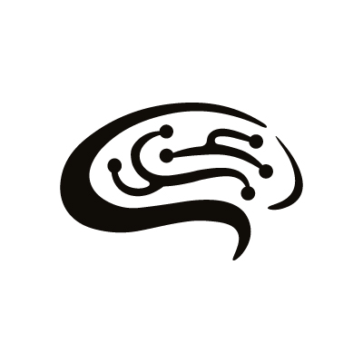

# 🧠 NeuroACT Lab

  

🔬 Investigating cognitive-motor flexibility across the lifespan  
🏛️ National Centre for Biological Sciences (NCBS), Bangalore  
🐀 Integrating neuroscience, behavior, biomechanics, and computation  
🌐 <a href="https://www.neuroact.in" target="_blank">www.neuroact.in</a>

## 🚀 About Us

The **NeuroACT Lab** aims to understand how internal cognitive computations dynamically engage with ongoing actions during complex behaviors, and how these interactions change with age.  
We employ an interdisciplinary approach, combining insights from neuroscience, behavior, biomechanics, and computational methods.

Our research focuses on:
- Neural mechanisms underlying spatial navigation and decision-making
- Coordination between action and memory processes
- Cognitive-motor changes during aging

## 👩🏽‍🔬 Our Team

- **Principal Investigator**: Dr. Abhilasha Joshi  
- **Research Associates, PhD Students, Interns**: <a href="https://www.neuroact.in/team" target="_blank">Meet the team</a>

We welcome students and collaborators passionate about neuroscience, behavior, and computation.

## 📫 Contact

📬 <a href="https://www.neuroact.in/contact" target="_blank">Contact us</a>

✨ Thank you for visiting the NeuroACT Lab GitHub! ✨

